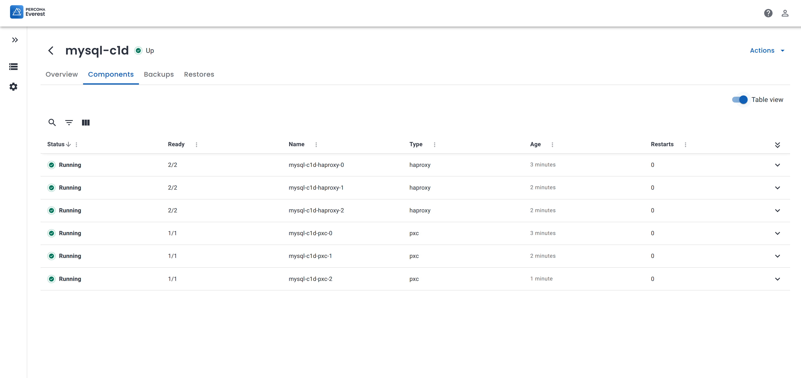

# Database view

The database view in Percona Everest provides an interface to view and provision your databases. With the database view, you can keep a close eye on all your databases and their status and perform tasks such as backup and restore.

   

Click on the individual database and select the ellipsis menu (...). This will allow you to perform various actions such as:

   

 -  **Restart the database** - Restarting your database can improve the performance of your database and enable you to apply recent configuration changes. 
    

 - **Create database from a backup** - With Percona Everest, you have the ability to create a database from a backup. 
    
    For more in-depth instructions on how to create a database from a backup, refer to the [create a database from a backup ](createBackups/create_new_database.md).

 - **Restore database from a backup** - With Percona Everest, you have the ability to restore your database from a backup. 
    
    For more in-depth instructions on how to restore a database, refer to the [restore a database from a backup](RestoreBackup.md) section.

 - **Suspend the database** - Suspending your database can save resources when it's not being used. 
    
    To resume your database click **Resume**. You database will be immediately resumed.

 - **Delete the database** - If you have a database that you no longer use, you can delete it to free up space or resources.

## Detailed database view

You can view a comprehensive overview of any specific database by clicking on the respective database. Once you do that, you will see the **Overview**, **Backups**, **Components** and **Restores** tabs.

## Overview

The Overview tab provides a comprehensive view of all the essential database details, such as:

- Basic information about the database
- Backups information
- Backups schedules information
- Point-in-time Recovery status
- Resources used by the database
- External access and monitoring status
- Information about host, port, and credentials

## Components

The Components page offers comprehensive information about pods and containers. Here, you can find everything you need to know, including their current status, types, age, and various other attributes, helping you gain a deep understanding of their functions and performance.

   

## Backups

The **Backups** tab lists all the backups created for the database. This includes the exact date and time when each backup was taken, providing you with a clear overview of the backup history for the database.

From the ellipsis (...) menu next to the database you can:

- [Restore the backup to database](../use/RestoreBackup.md#RestoreBackup). 

- [Create a new database from backup](createBackups/create_new_database.md#create_new_database). 

    

The **Backups** tab also displays all active schedules for the database. You can edit or delete schedules by clicking **Edit** or **Delete** respectively.

## Restores

The **Restores** tab displays a list of the database restores along with their respective dates and timestamps. This way, you can easily track and manage the history of all the restores that have been performed on the database.

To remove the database's restore entry, click **Delete** and the restored database will be deleted.

