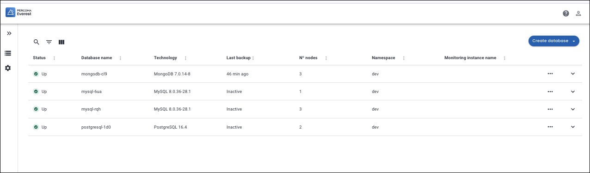
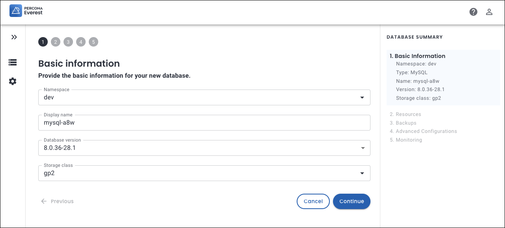
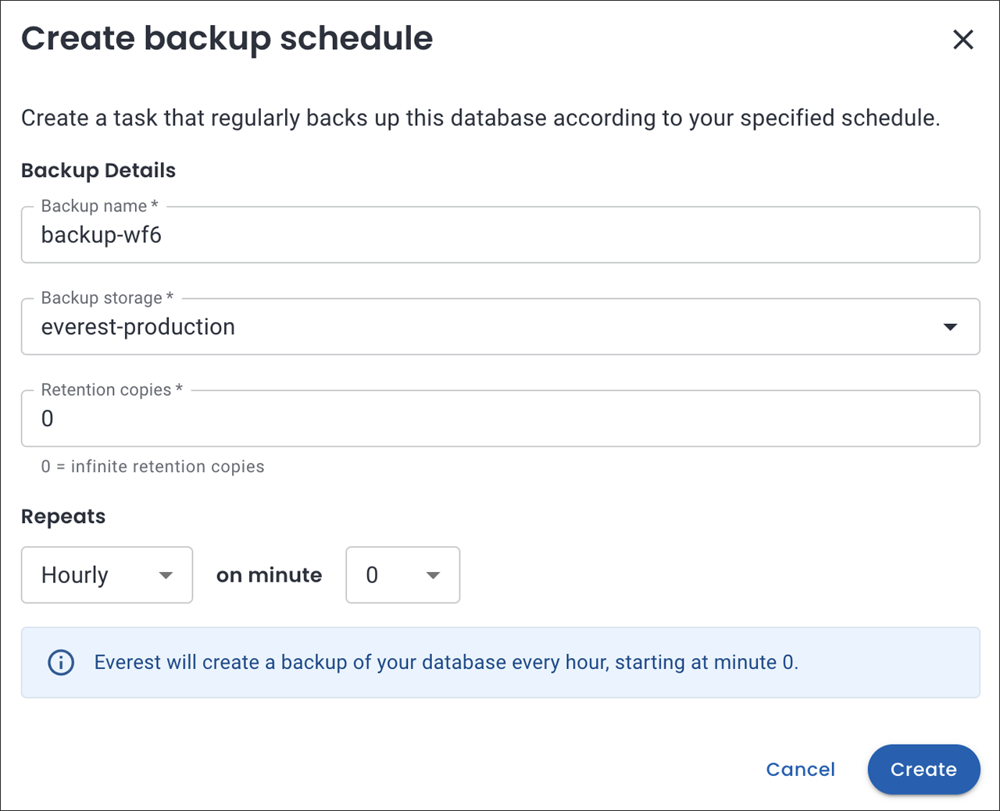
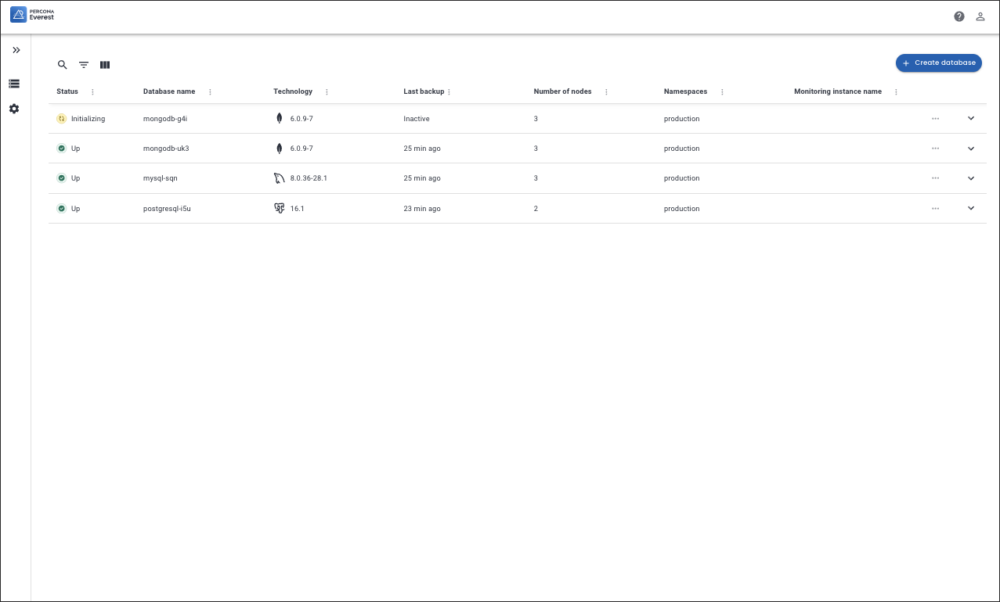

# Provision a database

Provisioning a database instance involves setting up and configuring a database instance on the Percona Everest platform.

!!! warning
    Refrain from changing the password of administrative users (e.g., root, monitor, or operator) manually in the database. This action may cause inconsistencies with the secrets stored in Kubernetes, which are crucial for the proper functioning of the cluster. Such modifications have the potential to disrupt your cluster.

    This is a temporary limitation and will be fixed in the subsequent releases.

## Procedure

To provision a new database:
{.power-number}

1. Log into the Percona Everest UI.

2. On the Percona Everest homepage, click **Create Database**. The **Basic information** page opens.

    

3. On the **Basic information** page, provide the following details:

       - Select the **Namespace** where you want to create your database.

       - Select the **Database type**: MySQL, MongoDB or PostgreSQL.

       - Choose a name for your database. The name is auto-populated, but you can modify it according to your needs.

       - Select the **Database version** from the dropdown.

       - In the **Storage class** field, select one of the classes created by your Kubernetes administrator. 
       
        Storage classes define what storage configuration and features will be used for storing your database data. Different classes map to different quality-of-service levels, backup policies, persistent volumes, or to arbitrary policies determined by your cluster administrator. For more information, see [Storage Classes](https://kubernetes.io/docs/concepts/storage/storage-classes/){:target="_blank"} in the Kubernetes documentation. 

        

5. On the **Resources** page, select the **Number of nodes**. Also, set the resources per node by selecting one of the predefined presets or by specifying the CPU, Memory, and Disk. For more information on resources, see the [Scale database deployment](../use/scaling.md) section.

6. On the **Scheduled Backups** page, set up a schedule if you wish to run backup jobs for your new database.

    Click **Create backup schedule**. The backup schedule pop-up is displayed.

    Provide the following details on this page:

      - Choose a name for your backup schedule. The name is auto-populated, but you can modify it according to your needs.
    
      - Select the **Backup storage** from the dropdown.
    
      - Enter the number of **Retention copies** for the backups.

        !!! note
            Currently, Retention copies are not supported for PostgreSQL databases.      
        
        Retention copies refer to the number of backup instances that should be kept.

        Example: When you set retention copies to 3, it means that you want to keep a maximum of 3 backup copies at any given time. So, if you have 3 backups already and then run a 4th backup, the oldest backup will get deleted automatically. 

            

7. On the **Scheduled Backups** page, you can also enable Point-in-time Recovery (PITR) by turning the toggle on.

8. On the **Advanced Configurations** page, you can enable external access and customise database engine parameters by turning the toggle button on. For in-depth information, see the [configure database engine](../use/db_engine_config.md) section.

9. On the **Monitoring** page, you can enable monitoring by turning the toggle button on and selecting the **Monitoring endpoint URL**. For information on adding monitoring endpoints, see the [monitoring endpoints](../use/monitor_endpoints.md) section.

10. Click **Create Database**.

11. Click **Go to list of my databases** to see the database that you provisioned.

    

## Video tutorial

You can also learn about creating databases by checking the video tutorial below:

<iframe width="560" height="315" src="https://www.youtube.com/embed/Oq1XKB8VXUk?si=JBLVJ9zBfpHGxL2I" title="YouTube video player" frameborder="0" allow="accelerometer; autoplay; clipboard-write; encrypted-media; gyroscope; picture-in-picture; web-share" allowfullscreen></iframe>
