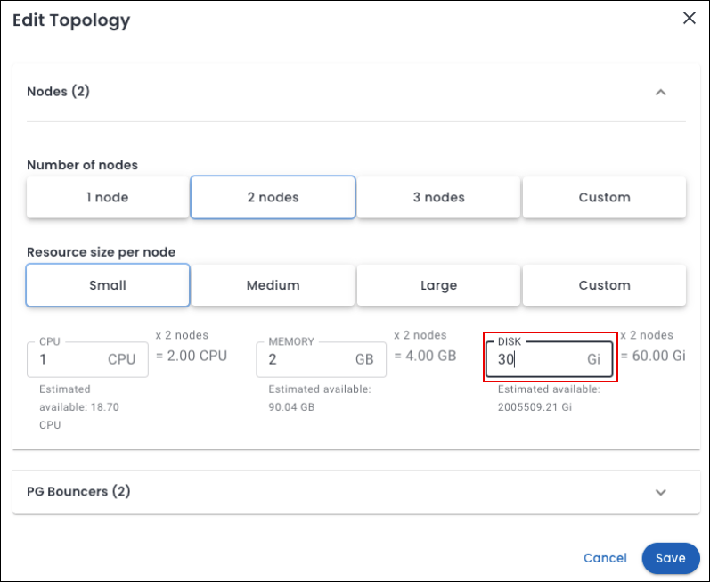

# Manual storage scaling

You can increase the capacity of your storage through manual storage scaling. This feature enables you to adapt to rising data demands, providing more flexibility in managing growing database workloads while ensuring system stability and data security.

## Storage management in Percona Everest

In Kubernetes environments running Percona Everest, storage is managed using *Persistent Volumes (PVs)* and *Persistent Volume Claims (PVCs)*. Everest automates storage provisioning through `StorageClasses`.

For storage scaling, Everest supports volume expansion, enabling users to increase storage size provided the associated `StorageClass` allows it.

For detailed information on PVs and PVCs, refer to the official [Kubernetes documentation](https://kubernetes.io/docs/concepts/storage/persistent-volumes/){:target="_blank"}.

## Prerequisites

- When scaling storage manually for a database managed by Percona Everest, ensure that the `StorageClass` used by the database's **PersistentVolumeClaim (PVC)** supports **volume expansion**. This setting allows the size of the underlying Persistent Volume to be increased after it has been created.

    !!! note
        In Kubernetes, manual disk scaling only works if the associated `StorageClass` has the following setting:

        ```sh
        allowVolumeExpansion: true
        ```

    To verify if your storage class allows for volume expansion, execute the following command:

    ```sh
    kubectl get storageclass
    ```

    ??? example "Expected output"
        ```
        NAME                   PROVISIONER             RECLAIMPOLICY   VOLUMEBINDINGMODE      ALLOWVOLUMEEXPANSION   AGE
        expandable-storage     kubernetes.io/aws-ebs   Delete          WaitForFirstConsumer   true                   42m
        ```

- When scaling storage in Percona Everest, always verify that [resource quotas](https://kubernetes.io/docs/concepts/policy/resource-quotas/#storage-resource-quota){:target="_blank"} allow the requested storage capacity. For more information, see the [known limitations](../reference/known_limitations.md#manual-storage-scaling) section.

## Editing storage capacity

!!! info "Important"
    - Cluster resizing is permanent and cannot be reversed.
    - Disk size can only be increased. Decreasing the disk is not supported to protect data integrity.

To modify storage capacity, follow these steps:
{.power-number}

1. Navigate to the **Overview** page for your database from the Percona Everest home page.

2. Click **Edit** in the Resources panel.  The **Edit Topology** pop-up will be displayed.

3. Locate the **DISK** field and enter the disk value (in Gi) to the new desired capacity.

    

4. Click **Save**.

5. After clicking **Save**, go back to the **Overview** page and check that the **DISK** field reflects the new capacity.

For information about the limitations of manual storage scaling, refer to the [known limitations](../reference/known_limitations.md#manual-storage-scaling) section.


