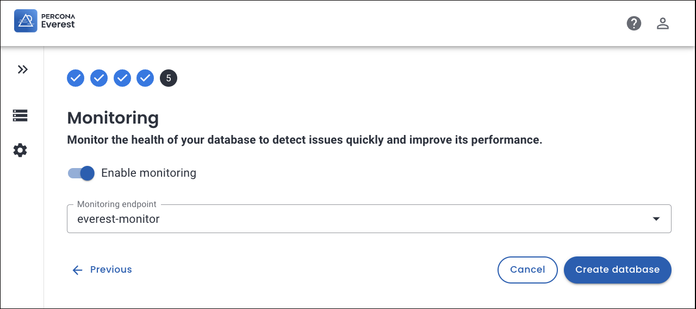
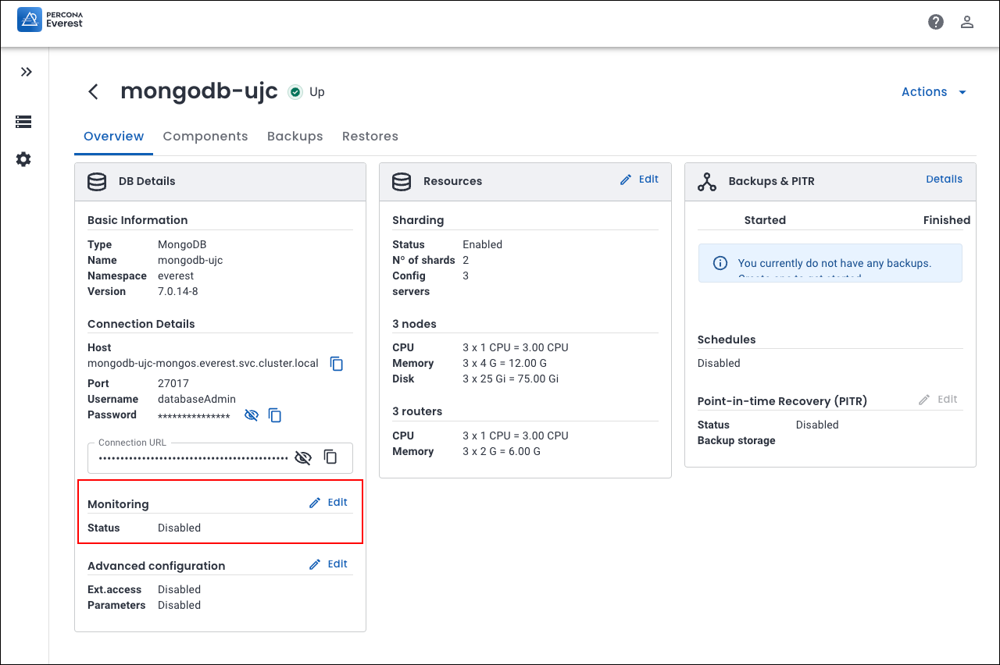
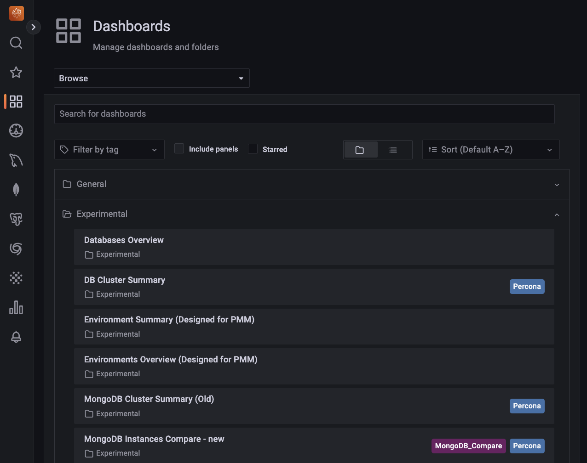
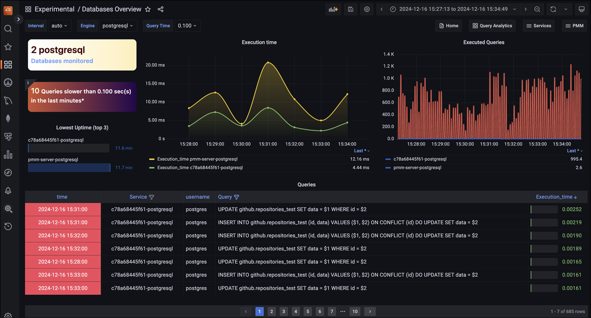
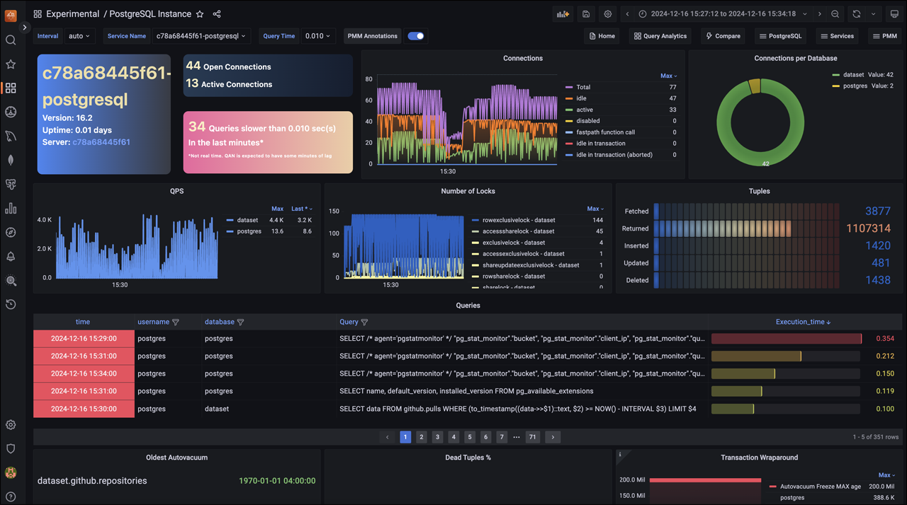
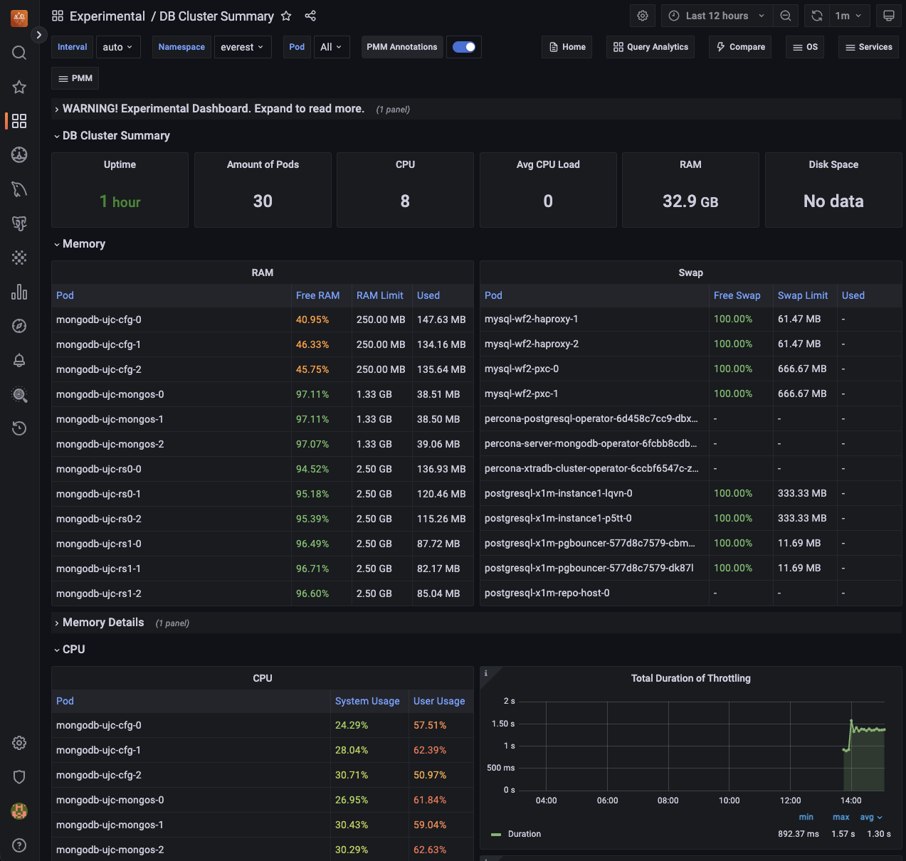

# Monitoring

Percona Everest provides monitoring capabilities with PMM to maintain a reliable and secure database infrastructure.

!!! info "Important"
    Currently only PMM v2.x is supported. Support for PMM v3.x is planned for future releases.

Here are some key benefits you'll get with monitoring of Percona Everest:

- Database availability and uptime tracking
- Insights into your database performance
- Proactive issue detection and addressing opportunities
- Continuous monitoring

## The concept of namespaces in monitoring

When you assign namespaces to a monitoring instance, it only determines which databases are authorized to utilize it; you cannot monitor specific namespaces. 

Each database can only be monitored by one instance, which means that the metrics for the database are only available to that instance.

When adding a new monitoring instance, the monitoring stack (kube-state-metrics and victoria-metrics) will automatically start pushing Kubernetes metrics to that instance.

## Prerequisites

To use monitoring in Percona Everest, you should have a PMM instance up and running.

For information on installing PMM, see the [documentation](https://docs.percona.com/percona-monitoring-and-management/3/quickstart/quickstart.html).

## Add monitoring endpoint

To add monitoring in Percona Everest from the UI:
{.power-number}

1. From the Percona Everest Homepage, navigate to <i class="uil uil-cog"></i> **Settings > Monitoring endpoints**. The **Add monitoring endpoint** dialogue box opens.

2. On the **Add monitoring endpoint screen**, enter a name for the monitoring instance.

    

3. Select the **namespaces** where the monitoring endpoint should be available.

4. In the **Endpoint** field, enter the PMM URL. Enter the credentials received upon installing PMM in the **User** and **Password** field.

    !!! warning
        When setting up a new monitoring instance, if your PMM instance uses a self-signed certificate, skip the **Verify TLS verification** checkbox.        

6. Click **Add**.

### Enable monitoring

#### Enable monitoring for a new cluster

You can enable monitoring for your cluster while creating the database.

To enable monitoring for your database cluster, follow these steps:
{.power-number}

1. From the Percona Everest Home page, click **Create Database**. The **Create Database** wizard opens.

2. Navigate till you reach the **Monitoring** page.

3. Turn on the **Enable monitoring** toggle.

    

4. Select the **Monitoring endpoint** from the drop down.

5.  Click **Create Database**. This will allow you to  monitor your database cluster.

### Enable monitoring for an existing cluster

You can enable monitoring for your cluster even after the database has been created.

To enable monitoring for your database cluster, follow these steps:
{.power-number}

1. Navigate to the Percona Everest homepage and choose the database cluster you want to monitor.

2. Navigate to the **Overview** page and look for the **Monitoring** panel. Click on **Edit**.

    

3. Turn on the **Enable monitoring** toggle.

4. Select the **Monitoring endpoint** from the drop-down.

5. Click **Save**. This will allow you to monitor your database cluster.

### Connect to PMM and monitor your databases

Here’s how to monitor your databases using PMM:
{.power-number}

1. Log in to PMM.

2. From the PMM home page, go to <i class="uil uil-apps"></i> **Dashboards > Experimental**. Here, you'll discover a comprehensive view of the various databases that you can view.

    

3. Go to **Experimental > Databases Overview** to access the **Database Overview** dashboard. The following image shows that two PostgreSQL databases are monitored.

    

4. On the **Databases Overview** dashboard, you can monitor a specific database. To do this, select the desired database **Engine** from the drop-down menu.

    

    On this dashboard, you will find a graphical representation that highlights the following:

    - A comprehensive list of databases under monitoring 
    - A clear identification of slow-performing queries 

    - The execution time for each query

    - A record of all executed queries, providing an overview of the activity. 

5. For instance, to get a comprehensive view of your PostgreSQL databases being monitored, go to <i class="uil uil-apps"></i> **Dashboards > Experimental > PostgreSQL Instance**.

    

6. To see a comprehensive list of all the pods in the cluster along with their respective CPU and RAM usage statistics, go to <i class="uil uil-apps"></i> **Dashboards > Experimental > DB Cluster Summary**. This provides insights into how your cluster performs and resources are allocated, enabling you to make informed decisions.

    

    If you're looking to dive deeper into the dashboard's features and functionality, check out the [PMM documentation](https://docs.percona.com/percona-monitoring-and-management//3/use/dashboards-panels/index.html).

## Edit monitoring endpoint

To edit a monitoring endpoint from the Percona Everest UI:
{.power-number}

1. From the Percona Everest Homepage, navigate to <i class="uil uil-cog"></i> **Settings > Monitoring endpoints**.

2. Click on the ellipsis (three dots) next to the endpoint you need to edit.

    

3. **Click Edit**. The **Edit monitoring endpoint** pop-up opens. In this dialogue box, edit the information as per your requirements.

     

4. Click **Add**.

## Delete monitoring endpoint

To delete a monitoring endpoint from the Percona Everest UI:
{.power-number}

1. From the Percona Everest Homepage, navigate to <i class="uil uil-cog"></i> **Settings > Monitoring endpoints**.

2. Click on the ellipsis (three dots) next to the endpoint you need to delete.

3. Click **Delete**. The **Delete monitoring endpoint** dialogue box opens.

     

4. Click **Delete**.

 

