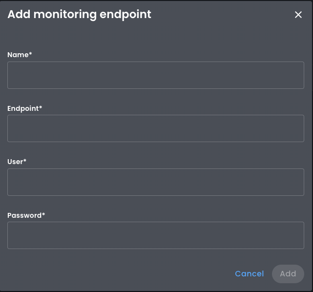
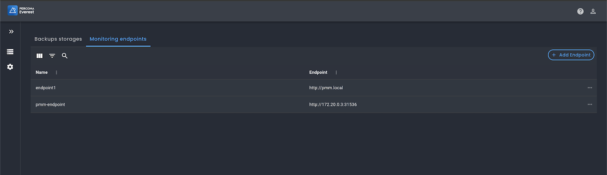
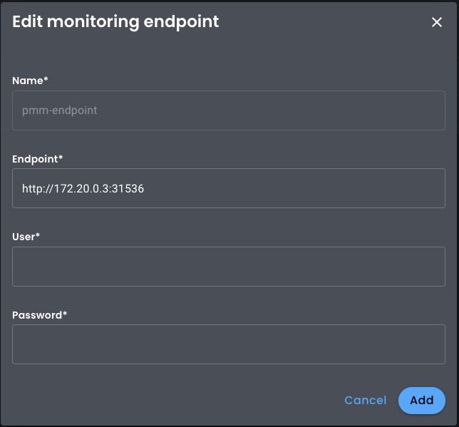

# Monitoring

Percona Everest provides monitoring capabilities with PMM to maintain a reliable and secure database infrastructure.

Here are some key values you'll get with monitoring of Percona Everest:

- Monitoring helps track database availability and uptime
- Monitoring provides insights into database performance
- Monitoring helps detect and address issues proactively
- Continuous monitoring helps maintain a stable and reliable database environment.


## Prerequisites

To use monitoring in Percona Everest you should have a PMM instance up and running.

For information on installing PMM, see [documentation] (https://docs.percona.com/percona-monitoring-and-management/setting-up/index.html).

## Add monitoring from the UI

!!! warning "warning"
    When setting up DB cluster monitoring, using endpoints added through the user interface will result in a limited selection of metrics being sent to PMM. To receive the full range of metrics (including k8s data points), configure monitoring endpoints using the [Everest CLI](../install/installEverestCLI.md) (`everestctl monitoring enable` command).

To add monitoring in Percona Everest from the UI:
{.power-number}

1. From the Percona Everest Homepage navigate to **Settings > Monitoring endpoints**. **Add monitoring endpoint** dialogue box opens.

2. On the **Add monitoring endpoint screen**, enter a PMM instance name. In the **User** and **Password** field, enter the credentials received upon installing PMM. In the **Endpoint** field, enter the PMM URL.

    

3. Click **Add**. The endpoint will be added.

    


## Edit monitoring endpoint from the UI

To edit a monitoring endpoint from Percona Everest UI:
{.power-number}

1. From the Percona Everest Homepage navigate to **Settings > Monitoring endpoints**.

2. Click on the ellipsis (three dots) next to the endpoint that you need to edit. **Edit monitoring endpoint** dialogue box opens.

    

3. Click **Add**.


## Add monitoring from the CLI


1. You can add monitoring in Percona Everest using **either** of the commands:

    ```sh
    everestctl monitoring enable
    ```

    Alternatively, navigate to the `percona-everest-cli` directory and run the following command:

    ```sh
    go run cmd/everest/main.go monitoring enable
    ```

2. Enter the following information on the CLI:

    - 'Everest URL Endpoint' - URL of the Everest instance
    - 'Everest Token' - The authorization token received while installing Everest
    - 'PMM URL Endpoint' - URL of the PMM instance
    - 'Username and Password' - Credentials for the PMM instance
    - 'Name for the new monitoring instance '- Any name that you want to give to the monitoring instance
    
3. Go to Percona Everest UI and navigate to **Settings > Monitoring endpoints**. This monitoring instance will be added on this page.


### Limitations

!!! warning "warning"
    The `everestctl monitoring enable` command is not very intuitive. There are certain limitations when using this command which will be fixed in the upcoming release.


=== "**Limitation 1**"

    When you run `everestctl monitoring enable` command, the everest pod will restart. If you're using port-forwarding to access Everest (kubectl port-forward svc/everest 8080:8080 -n percona-everest), the port-forwarding will stop, and the command will fail. 

    **Solution**

    Stop the port-forwarding command that you ran during the installation and run the following command before you run the `everestctl monitoring enable` command.

    ```sh
    kubectl port-forward svc/everest 8080:8080 -n percona-everest; kubectl port-forward svc/everest 8080:8080 -n percona-everest 
    ```
    This ensures that if the connection is dropped due to an everest restart, a new port-forwarding tunnel will be created to resume the connection.


=== "**Limitation 2**"

    The `everestctl monitoring enable` command is not very intuitive. 
    
    When using this command, you can have the following scenarios:

    **Scenario 1**

    If you haven't configured monitoring points in the UI, then leave the **Registered instance name** field empty.

    ```sh
    everestctl monitoring enable
    ```
    
    ??? example "Output"

        ```sh
        ? Everest URL endpoint http://127.0.0.1:8080
        ? Everest Token ********************************************************************************************************************************
        ? Registered instance name
        ? PMM URL Endpoint http://127.0.0.1
        ? Username admin
        ? Password *****
        ? Name for the new monitoring instance - dev-pmm
        ```
   
    If you are running the command in wizard mode or headless mode (`--skip-wizard` flag):

    ```sh
    everestctl monitoring enable --everest-url='http://127.0.0.1:8080' --everest-token=<token> --new-instance-name='dev-pmm' --pmm.endpoint='http://127.0.0.1' --pmm.username='admin' --pmm.password=<password> --skip-wizard
    ```


    **Scenario 2**
    
    If you already have a monitoring endpoint configured in the UI and want to use it to receive the full set of metrics (including k8s metrics). In this case, enter a value in **Registered instance name** field.


    ??? example "Output"

        ```sh
        everestctl monitoring enable
        ? Everest URL endpoint http://127.0.0.1:8080
        ? Everest Token ********************************************************************************************************************************
        ? Registered instance name dev-pmm
        ```

        If you are running the command in wizard mode or headless mode (`--skip-wizard` flag):

        ```sh
        everestctl monitoring enable --everest-url='http://127.0.0.1:8080' --everest-token=<token> --instance-name='dev-pmm' --skip-wizard
        ```


 


