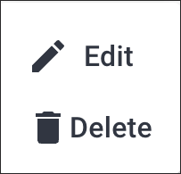
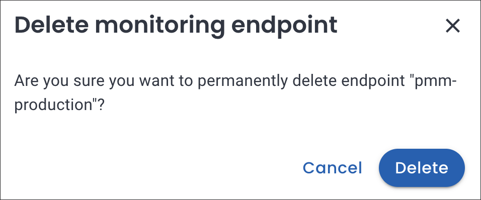

# Monitoring

Percona Everest provides monitoring capabilities with PMM to maintain a reliable and secure database infrastructure.

Here are some key benefits you'll get with monitoring of Percona Everest:

- Database availability and uptime tracking
- Insights into your database performance
- Proactive issue detection and addressing opportunities
- Continuous monitoring

## The concept of namespaces in monitoring

When you assign namespaces to a monitoring instance, it only determines which databases are authorized to utilize that monitoring instance. However, you cannot monitor specific namespaces. 

Each database can only be monitored by one instance, which means that the metrics for the database are only available to that instance.

When monitoring k8s metrics with kube-state-metrics and victoria-metrics, adding a new monitoring instance will automatically trigger the VMAgent to push all k8s metrics to that instance. These are k8s metrics and not namespace metrics.

## Prerequisites

To use monitoring in Percona Everest, you should have a PMM instance up and running.

For information on installing PMM, see the [documentation](https://docs.percona.com/percona-monitoring-and-management/setting-up/index.html).

## Add monitoring

To add monitoring in Percona Everest from the UI:
{.power-number}

1. From the Percona Everest Homepage, navigate to <i class="uil uil-cog"></i> **Settings > Monitoring endpoints**. The **Add monitoring endpoint** dialogue box opens.

2. On the **Add monitoring endpoint screen**, enter a name for the monitoring instance.

    

3. Select the **namespaces** where the monitoring endpoint should be available.

4. In the **User** and **Password** field, enter the credentials received upon installing PMM. In the **Endpoint** field, enter the PMM URL.

6. Click **Add**.

## Edit monitoring

To edit a monitoring endpoint from the Percona Everest UI:
{.power-number}

1. From the Percona Everest Homepage, navigate to <i class="uil uil-cog"></i> **Settings > Monitoring endpoints**.

2. Click on the ellipsis (three dots) next to the endpoint you need to edit.

    

3. Click **Edit**. The **Edit monitoring endpoint** dialogue box opens. Edit the information as per your requirement on this dialogue box.

     

3. Click **Add**.

## Delete monitoring

To delete a monitoring endpoint from the Percona Everest UI:
{.power-number}

1. From the Percona Everest Homepage, navigate to <i class="uil uil-cog"></i> **Settings > Monitoring endpoints**.

2. Click on the ellipsis (three dots) next to the endpoint you need to delete.

3. Click **Delete**. The **Delete monitoring endpoint** dialogue box opens.

     

4. Click **Delete**.

 

