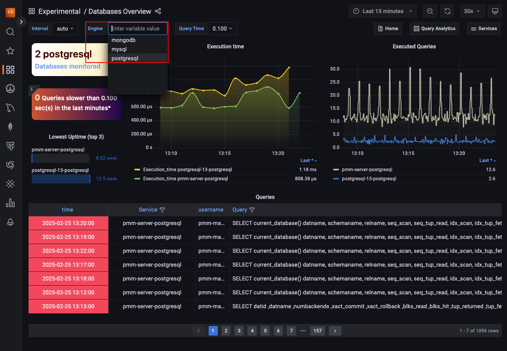

# Monitoring

Percona Everest provides monitoring capabilities with PMM to maintain a reliable and secure database infrastructure.

Here are some key benefits you'll get with monitoring of Percona Everest:

- Database availability and uptime tracking
- Insights into your database performance
- Proactive issue detection and addressing opportunities
- Continuous monitoring

## The concept of namespaces in monitoring

When you assign namespaces to a monitoring instance, it only determines which databases are authorized to utilize that monitoring instance, you cannot monitor specific namespaces. 

Each database can only be monitored by one instance, which means that the metrics for the database are only available to that instance.

When adding a new monitoring instance, the monitoring stack (kube-state-metrics and victoria-metrics) will automatically start pushing kubernetes metrics to that instance.

## Prerequisites

To use monitoring in Percona Everest, you should have a PMM instance up and running.

For information on installing PMM, see the [documentation](https://docs.percona.com/percona-monitoring-and-management/setting-up/index.html).

## Add monitoring endpoint

To add monitoring in Percona Everest from the UI:
{.power-number}

1. From the Percona Everest Homepage, navigate to <i class="uil uil-cog"></i> **Settings > Monitoring endpoints**. The **Add monitoring endpoint** dialogue box opens.

2. On the **Add monitoring endpoint screen**, enter a name for the monitoring instance.

    

3. Select the **namespaces** where the monitoring endpoint should be available.

4. In the **Endpoint** field, enter the PMM URL. In the **User** and **Password** field, enter the credentials received upon installing PMM.

    !!! warning
        When setting up a new monitoring instance, if your PMM instance uses a self-signed certificate, skip the **Verify TLS verification** checkbox.        

6. Click **Add**.

### Connect to PMM and monitor your databases

Here’s how to monitor your databases using PMM:
{.power-number}

1. Log in to PMM.

2. From the PMM home page, go to <i class="uil uil-apps"></i> **Dashboards > Experimental**. Here, you'll discover a comprehensive view of the various databases that you can view.

    

3. Go to **Experimental > Databases Overview** to access the **Database Overview** dashboard. In the following image you can see that two PostgreSQL databases are being monitored.

    

4. On the **Databases Overview** dashboard, you have the option to monitor a specific database. To do this, select the desired database's **Engine** from the drop-down menu.

    

    On this dashboard, you will find a graphical representation that highlights the following:

    - A comprehensive list of databases under monitoring 
    - A clear identification of slow-performing queries 
    - A record of all executed queries, providing an overview of the activity 
    - The execution time for each query, allowing for performance analysis and optimization.

5. If you want a comprehensive view of, say, your PostgreSQL databases being monitored, go to <i class="uil uil-apps"></i> **Dashboards > Experimental > PostgreSQL Instance**.

    

## Edit monitoring endpoint

To edit a monitoring endpoint from the Percona Everest UI:
{.power-number}

1. From the Percona Everest Homepage, navigate to <i class="uil uil-cog"></i> **Settings > Monitoring endpoints**.

2. Click on the ellipsis (three dots) next to the endpoint you need to edit.

    

3. Click **Edit**. The **Edit monitoring endpoint** dialogue box opens. Edit the information as per your requirement on this dialogue box.

     

4. Click **Add**.

## Delete monitoring endpoint

To delete a monitoring endpoint from the Percona Everest UI:
{.power-number}

1. From the Percona Everest Homepage, navigate to <i class="uil uil-cog"></i> **Settings > Monitoring endpoints**.

2. Click on the ellipsis (three dots) next to the endpoint you need to delete.

3. Click **Delete**. The **Delete monitoring endpoint** dialogue box opens.

     

4. Click **Delete**.

 

